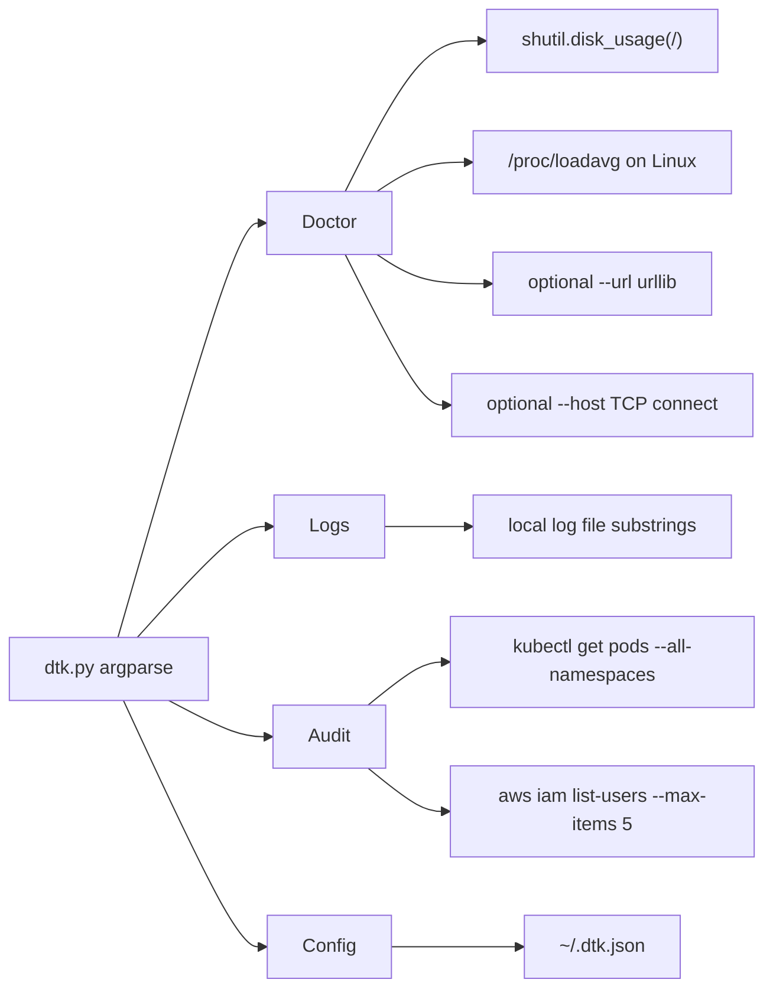

# DevOps Toolkit (`dtk`)

[](LICENSE)

Python 3 stdlib CLI for **local** health checks, log-line anomaly scanning, and best-effort kubectl/AWS probes.

This is not a compiled binary and it does not configure AWS or kube credentials. The implementation is [`dtk.py`](dtk.py).

---

## Architecture



---

## Requirements

- Python 3 (standard library only: `argparse`, `json`, `urllib`, `socket`, `shutil`, `subprocess`)
- Optional: `kubectl` and AWS CLI on `PATH` for `dtk audit`
- Unix `sudo` only if you use `install.sh`

---

## Quickstart

```bash
git clone https://github.com/donny-devops/devops-toolkit.git
cd devops-toolkit
python3 dtk.py doctor
```

Install to `/usr/local/bin/dtk` (Unix, requires sudo and a local checkout so `dtk.py` sits next to `install.sh`):

```bash
./install.sh
dtk doctor
```

`curl …/install.sh | bash` will not work: the script copies `./dtk.py` from the directory that contains `install.sh`, and `sudo -S` reads the password from stdin.

On Windows, run `python3 dtk.py …`. `install.sh` is bash/`sudo` only.

---

## Commands

| Command | What it does |
| --- | --- |
| `dtk doctor` | Hostname, platform, root disk usage (WARN at ≥90%), Linux load average |
| `dtk doctor --url URL` | Plus HTTP GET (`User-Agent: dtk/1.0`); 200–399 is OK |
| `dtk doctor --host HOST` | Plus TCP connect on ports 22, 80, 443, 3306, 5432, 6379 |
| `dtk logs FILE` | Case-insensitive substring counts: error, fatal, exception, traceback, out of memory, oom, killed, panic, critical, segfault |
| `dtk audit` | Best-effort: count `kubectl` pods; probe `aws iam list-users --max-items 5`. Skips if the CLI is missing |
| `dtk config --init` | Writes `{"created": <utc iso>, "version": "1.0.0"}` to `~/.dtk.json` |
| `dtk config` | Prints `~/.dtk.json` or tells you to run `--init` |

```bash
python3 dtk.py doctor --url https://example.com --host example.com
python3 dtk.py logs /var/log/syslog
python3 dtk.py audit
python3 dtk.py config --init
```

---

## Constraints and pitfalls

- **`--all` is a no-op.** `cmd_doctor` accepts `--all` but never reads it. Extra checks only run when `--url` / `--host` are set.
- **Config is unused.** Other commands do not read `~/.dtk.json` or AWS/kube contexts.
- **`doctor` always exits 0.** HTTP/disk failures are printed, not returned as a non-zero status. `logs` returns 1 only if the file is missing.
- **Audit is not a security scanner.** It does not inspect deployments, RBAC, or IAM policies; it lists pods and tries `list-users`.
- **Logs is not ML.** It counts substrings and prints one ~100-character sample per matching pattern.
- **Security workflows only.** The repo has gitleaks, trufflehog, OpenSSF Scorecard, and dependency-review. There is no `ci.yml`, Codecov, or GitHub Release yet.

## License

MIT © Adonis Jimenez
