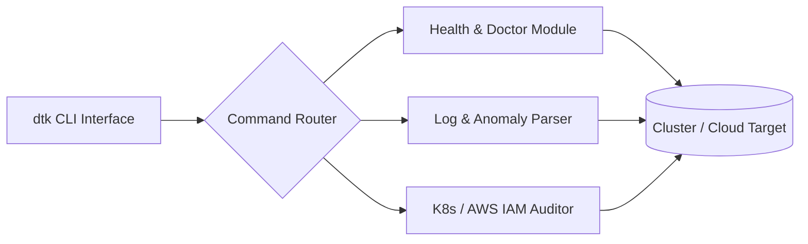

# 🛠️ DevOps Toolkit (`dtk`)

[](https://github.com/donny-devops/devops-toolkit/actions)
[](https://codecov.io/gh/donny-devops/devops-toolkit)
[](https://github.com/donny-devops/devops-toolkit/releases)
[](LICENSE)

> Swiss-army CLI for cloud health checks, automated log parsing, cluster triage, and Kubernetes/AWS resource auditing.

---

## 🏛️ Architecture



---

## ⚡ Quickstart

```bash
# 1. Download & Install CLI
curl -fsSL https://raw.githubusercontent.com/donny-devops/devops-toolkit/main/install.sh | bash

# 2. Configure Credentials (Uses standard AWS/Kube context)
dtk config init

# 3. Run Full System Diagnostic
dtk doctor --all
```

---

## Features

- **Automated Health Checks**: One-command cluster diagnostics (`dtk doctor`).
- **Log Anomaly Detection**: High-speed log analysis for fatal errors, OOMs, and stack traces.
- **Resource Auditing**: Scans Kubernetes pods, deployments, and AWS IAM roles for security misconfigurations.
- **Cross-Platform**: Zero-dependency standalone binary for Linux, macOS, and Windows.

## License

MIT © Adonis Jimenez
